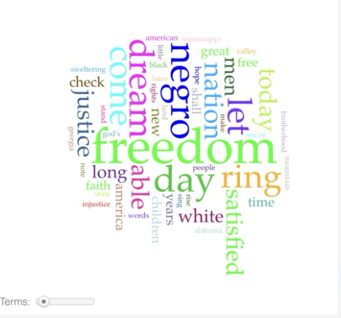



# Distant Reading Assignment 

Martin Luther King Jr.’s “I Have a Dream” – Distant Reading Project
Voyant Visualization
Here is the Voyant word cloud for Martin Luther King Jr.’s historic "I Have a Dream" speech. The size of each word corresponds to its frequency in the speech, highlighting the themes that surface repeatedly.

---
CoPilot Replies
Martin Luther King Jr.’s speech centers on the urgent demand for racial equality and justice in America. He highlights the broken promises of freedom and rights for Black Americans, emphasizing the ongoing struggles of segregation, discrimination, and poverty. King calls for peaceful resistance and unity, envisioning a future where people are judged by character, not skin color. His dream is rooted in hope, faith, and the belief that freedom and brotherhood will one day prevail across the nation.
MLK uses repetition to reinforce key ideas and create a rhythmic, memorable structure—most notably in the phrase “I have a dream,” which emphasizes his vision for a just future. He employs metaphors like “a bad check” to illustrate the betrayal of constitutional promises and “the quicksands of racial injustice” versus “the solid rock of brotherhood” to contrast instability with unity. These devices evoke strong emotional responses, clarify complex issues, and inspire collective action by painting vivid, relatable images.
---
Reflection and Summary
This distant reading exercise highlights how digital tools can quickly surface patterns and themes in a text, while also revealing their limitations. The Voyant word cloud shows that freedom, negro, dream, ring, let, and day are among the most frequent words. Additional statistics, such as a vocabulary density of roughly 0.325, a readability index of 8.551, and an average of 20 words per sentence, suggest the speech is concise and accessible. These metrics confirm what readers intuitively feel: King repeats key words to build rhythm and momentum. CoPilot’s summary captures the speech’s themes of racial justice, unity, and hope while noting how metaphors and repetition create emotional impact. Taken together, these tools demonstrate that distant reading can highlight word patterns and provide thematic summaries, but they cannot replace human interpretation of context, tone, and historical significance. The human eye and mind remain essential for understanding why words like freedom resonate and how rhetorical devices move an audience.

